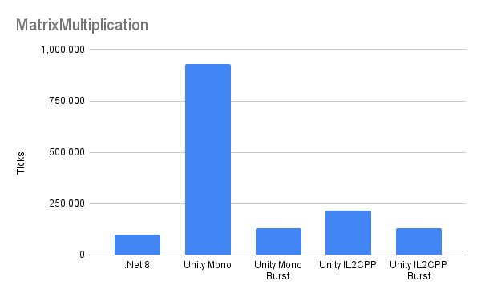
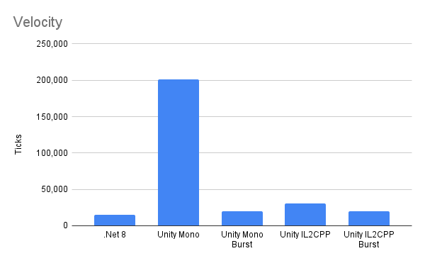
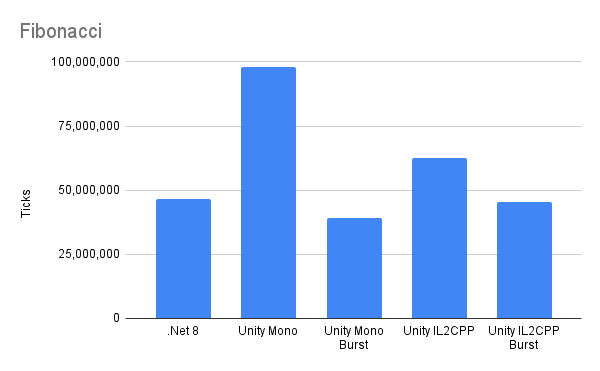

# dotnet-burst-comparison

## What Is?

This is a collection of benchmarks implemented in various .NET environments: .NET, Unity's default runtime (Mono), IL2CPP, and Burst. In particular this focuses on loop vectorization and math. Two of the benchmarks (Fibonacci, SieveOfEratosthenes, Mandelbrot) are from [BurstBenchmarks](https://github.com/nxrighthere/BurstBenchmarks). All benchmarks use the recommended types for each platform (`UnityEngine.*` for non-Burst Unity, `Unity.Mathematics.*` for Burst, and `System.Numerics.*` for plain .NET) including the benchmarks ported from BurstBenchmarks. All these tests are single-threaded.

## How To?

These instructions are written assuming you are running Windows on an x86_64 CPU.

All commands are executed from the repository root.

### Unity Project

Build the Unity project by opening the Unity project and use the Build > Windows menu item or this command:

```
"C:\Program Files\Unity\Hub\Editor\2023.1.13f1\Editor\Unity.exe" -batchmode -nographics -quit -projectPath unity\DotNetBurstComparison -executeMethod Editor.Build.BuildWindows -logfile unity\DotNetBurstComparison\Builds\Windows\log.txt
```

To run the Mono Unity program:

```
.\unity\DotNetBurstComparison\Builds\Windows\Mono\UnityBench.exe -batchmode -nographics -logfile unity\DotNetBurstComparison\Builds\Windows\Mono\log.txt
```

To run the IL2CPP Unity program:

```
.\unity\DotNetBurstComparison\Builds\Windows\IL2CPP\UnityBench.exe -batchmode -nographics -logfile unity\DotNetBurstComparison\Builds\Windows\IL2CPP\log.txt
```

The results will be in the log files in the commands above. Sadly Unity does not write logs to the command-line on Windows. (at the time of writing)

### .NET Project

Build the .NET project with this command:

```
dotnet build .\dotnet\DotNetBurstComparison\DotNetBurstComparison.sln -c Release
```

To run the .NET program:

```
dotnet dotnet\DotNetBurstComparison\DotNetBurstComparison.Dotnet\bin\Release\net8.0\DotNetBurstComparison.Dotnet.dll
```

The results will be printed to standard out.

## Results

Each benchmark is run twice to let each runtime warm up. These results are from the second run. Smaller values are better.









The computer running these tests:
* CPU: Intel Core i9 9900K @ 5GHz (all cores)
* Memory: 32GB DDR4 @ 3200MHz
* OS: Windows 10 Version 10.0.19045 Build 19045

### Conclusions

TLDR for SIMD workloads: IL2CPP+Burst > .NET8 == Mono+Burst > IL2CPP > Mono

Surprisingly .NET 8 can be competitive with Mono+Burst, except in SieveOfEratosthenes for some reason. (not sure why)

IL2CPP+Burst is crazy fast. If you don't need modding support for your Unity game and you are using Mono+Burst it seems like a no-brainer to switch to IL2CPP+Burst. (as long as you can support the more complicated build environment)

Unity's default Mono (without Burst) runtime is particularly atrocious. It would be wonderful to see Unity update to .NET 8 but I understand that it is mre complicated than just flipping a switch. And they have already announced they are moving in that direction.
